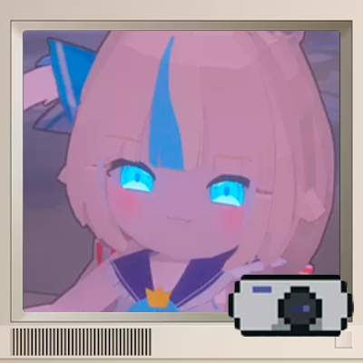

<p align="center">
  
</p>

<h1 align="center">MakeMeVtuber</h1>

<p align="center">
  A lightweight client-side Fabric mod for Minecraft 1.21.1<br>
  Transform your player into a VTuber-style avatar with a single command.
</p>

<p align="center">
  
  
  
  
</p>

---

## Preview

| In-game Render | Settings Window |
|:-:|:-:|
|  |  |

---

## Features

- **VTuber avatar** — renders your player model in a separate window with chromakey background
- **Microphone lip-sync** — mouth opens based on mic volume in real-time
- **Spring camera** — smooth camera attached to the face, follows head movement
- **Chromakey options** — green, blue, or transparent background
- **Customizable mouth** — position, size, threshold, intensity sliders
- **Dither fade** — body parts dissolve with stipple pattern when looking down
- **Lightweight** — runs in a separate thread, minimal impact on game performance

---

## Requirements

| | Version |
|---|---|
| Minecraft | 1.21.1 |
| Fabric Loader | ≥ 0.18.4 |
| Fabric API | Any |
| Java | ≥ 21 |

---

## Installation

1. Install [Fabric Loader](https://fabricmc.net/use/installer/)
2. Install [Fabric API](https://modrinth.com/mod/fabric-api)
3. Place `make-me-vtuber-1.0.0.jar` into the `mods` folder
4. Launch the game

---

## Usage

Open chat and type:

```
/mmv
```

This opens:
- **Render window** — your VTuber avatar with chromakey background
- **Settings window** — configure background, microphone, and mouth parameters

---

## Author

**taimleek-afk**

---

## Links

- GitHub: [github.com/taimleek-afk/MakeMeVtuber](https://github.com/taimleek-afk/MakeMeVtuber)

---

## License

[MIT License](LICENSE)
